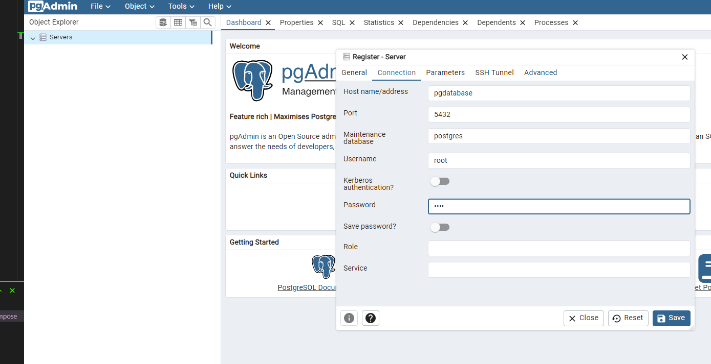
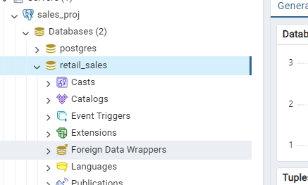

# Assignment 5
## Building a Data Pipeline in Python
First, I installed docker and docker compose in my personal computer. After setting everything. 

Run `docker-compose -p sales_proj up` to star the containers that have a postgres containger and a pgadmin container. Both connected inside the docker compose network

Once everything is running, you can test that the database is created by going to `localhost:8080' to connect to the pgadmin. It is necessary to connect with the credentials written in the docker compose file. 

If the db is there you can continue with the script

With the script it is necessary to run the first cell to install dependecies and finally just run the next cell after another until you can check that all the data was succesfully ingested. 

